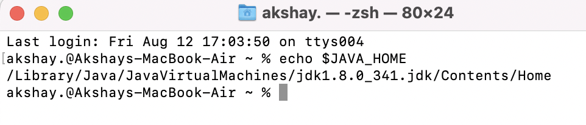

Download and install [java 8](https://www.oracle.com/java/technologies/downloads/#java8)

To check java version

```
java -version
```

Check the guide to set JAVA_HOME [here](https://mkyong.com/java/how-to-set-java_home-environment-variable-on-mac-os-x/)

To verify successfull setup, type

```
echo $JAVA_HOME
```

You should see something like this

