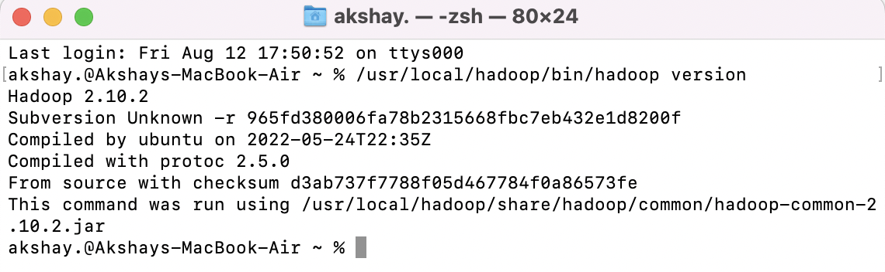

1. Download the most recent Hadoop v2 branch distribution (Hadoop 2.2.0 or later)
   from http://hadoop.apache.org/releases.html (binary download) <br/>
   Direct Link: https://dlcdn.apache.org/hadoop/common/hadoop-2.10.2/hadoop-2.10.2.tar.gz

2. Unzip the Hadoop distribution using the following command. You will have to change the x.x. in the filename to the actual release you have downloaded.
   ```
   $ tar -zxvf hadoop-2.x.x.tar.gz
   ```
3. Finally, you’ll move the extracted files into /usr/local, the appropriate place for locally installed software:

   ```
   $ sudo mv hadoop-2.x.x /usr/local/hadoop
   ```

   So, {HADOOP_HOME} = /usr/local/hadoop

4. Now, you can run Hadoop jobs through the {HADOOP_HOME}/bin/hadoop command, and we will elaborate on that further in the next recipe.

Verification:

```
$ {HADOOP_HOME}/bin/hadoop version
```


